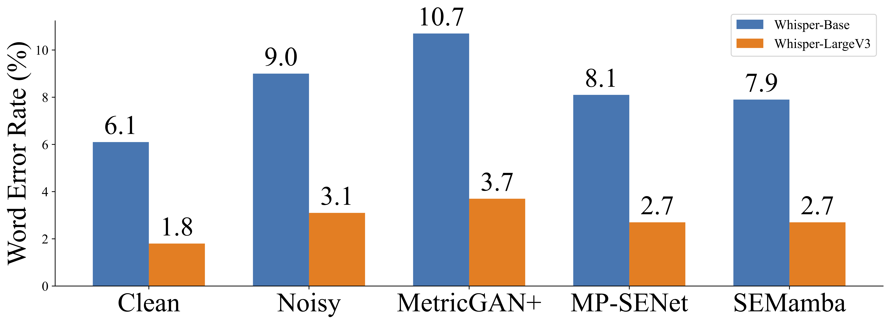

# SEMamba
This is the official implementation of the SEMamba paper.  
For more details, please refer to: [An Investigation of Incorporating Mamba for Speech Enhancement](https://arxiv.org/abs/2405.06573)

Note: The complete code will be released in the future.

## Requirement
    * Python >= 3.9
    * CUDA >= 12.0
    * PyTorch == 2.2.2

## Model
> The complete code will be released in the future.

## ASR Word Error Rate
We have tested the ASR results using OpenAI Whisper on the test set of VoiceBank-DEMAND.
> The evaluation code will be released in the future.



## Evaluation
The evaluation metrics is calculated via: [CMGAN](https://github.com/ruizhecao96/CMGAN/blob/main/src/tools/compute_metrics.py)  
> The evaluation code will be released in the future.

## Perceptual Contrast Stretching
The implementation of Perceptual Contrast Stretching (PCS) as discussed in our paper can be found at [PCS400](https://github.com/RoyChao19477/PCS/tree/main/PCS400).


## Citation:
If you find the paper useful in your research, please cite:  
```
@article{chao2024investigation,
  title={An Investigation of Incorporating Mamba for Speech Enhancement},
  author={Chao, Rong and Cheng, Wen-Huang and La Quatra, Moreno and Siniscalchi, Sabato Marco and Yang, Chao-Han Huck and Fu, Szu-Wei and Tsao, Yu},
  journal={arXiv preprint arXiv:2405.06573},
  year={2024}
}
```
